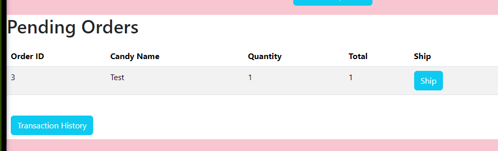
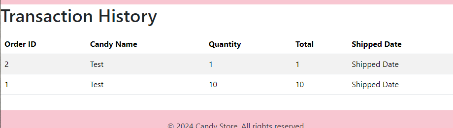

# API


- **Methods**: `POST`, `GET`, `GET`, `PUT`, `DELETE`,
- **Paths**: `/orders`, `/orders/{order_id}`

## Get All Orders
- **Path**: `/orders`
- **Method**: GET
Response:
```
[
  {
    "id": 2,
    "candy_id": {
      "id": 1,
      "name": "Test",
      "business": 2,
      "picture_url": "ASDF",
      "description": "test",
      "price": 1,
      "stock": 100
    },
    "quantity": 1,
    "sold": true
  },
  {
    "id": 1,
    "candy_id": {
      "id": 1,
      "name": "Test",
      "business": 2,
      "picture_url": "ASDF",
      "description": "test",
      "price": 1,
      "stock": 100
    },
    "quantity": 1,
    "sold": true
  }
]
```

## Create An Order
- **Path**: `/orders`
- **Method**: POST
Request body:
```
{
  "candy_id": 1,
  "quantity": 1,
  "sold": false
}
```
Response:
```
{
  "id": 3,
  "candy_id": {
    "id": 1,
    "name": "Test",
    "business": 2,
    "picture_url": "ASDF",
    "description": "test",
    "price": 1,
    "stock": 100
  },
  "quantity": 1,
  "sold": false
}
```

## Get One Order
- **Path**: `/orders/{order_id}`
- **Method**: GET

order_id: 1
Response:
```
{
  "id": 1,
  "candy_id": {
    "id": 1,
    "name": "Test",
    "business": 2,
    "picture_url": "ASDF",
    "description": "test",
    "price": 1,
    "stock": 100
  },
  "quantity": 1,
  "sold": true
}
```

## Update An Order
- **Path**: `/orders/{order_id}`
- **Method**: POST

order_id: 1
Request body:
```
{
  "candy_id": 1,
  "quantity": 10,
  "sold": true
}
```
Response:
```
{
  "id": 1,
  "candy_id": {
    "id": 1,
    "name": "Test",
    "business": 2,
    "picture_url": "ASDF",
    "description": "test",
    "price": 1,
    "stock": 100
  },
  "quantity": 10,
  "sold": true
}
```

## Delete an order
- **Path**: `/orders/{order_id}`
- **Method**: DELETE

order_id: 1
Response:
```
true
```
# GHI

## Pending Orders

This page will show every pending order that customers have made. There is a "ship" button to remove that order from the page, and send it to the "transaction history" by setting the
sold property from false to true.



## Transaction History

This page shows every sold order by date. The date aspect is not currently available at the moment, but will be soon. For now, under "Shipped Date" will always show "Shipped Date".


