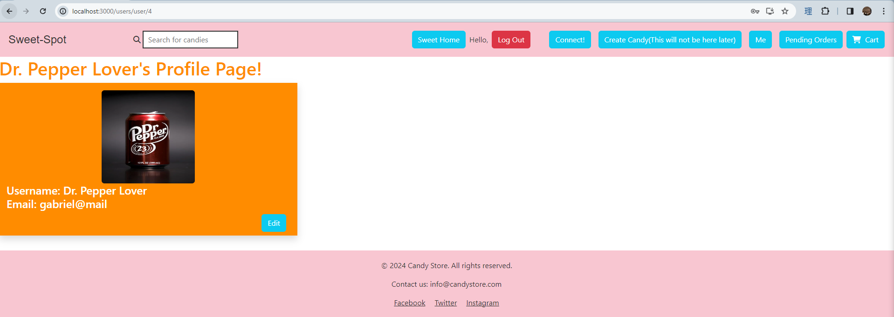

# The Sweet Spot

- Anna Hou
- Brian Argenti
- Joshua Lao
- Skylar Stout

## User Table Design
- Users table shape:
        users (
            id,
            email,
            picture_url,
            username,
            hashed_password,
            business
        )

- The id serves as the primary key to differentiate users from one another.
- The email is a unique field that allows only one instance of a user with
  that email address.
- Fields picture-url, and username allow for personal customization of each profile.
- The hashed-password field is stored here to compare against the password the user
  puts in at the login screen.
- The business field is a foreign key, which is an integer that references a business
  id whenever the business is created.

# API Endpoints

**Method**: `POST`, `GET`
**Path**: `/users`

Input:
    {
  "email": "string",
  "picture_url": "string",
  "username": "string",
  "password": "string",
  "business": int
}

Response (Create User):
    {
  "access_token": "string",
  "token_type": "Bearer",
  "account": {
    "id": 0,
    "email": "string",
    "picture_url": "string",
    "username": "string",
    "business": {
      "business_id": int,
      "business_name": "string",
      "business_email": "string"
    }
  }
}

Response (List All Users):
    [
  {
    "id": 0,
    "email": "string",
    "picture_url": "string",
    "username": "string",
    "business": {
      "business_id": 0,
      "business_name": "string",
      "business_email": "string"
    }
  }
]

**Method**: `GET`, `DELETE`
**Path**: `users/id`

Input:
    id: int

Response (Get One User):
    {
  "id": 0,
  "email": "string",
  "picture_url": "string",
  "username": "string",
  "business": {
    "business_id": 0,
    "business_name": "string",
    "business_email": "string"
  }
}

Respone (Delete):
{
    true
}

**Method**: `PUT`
**Path**: `user/id`

Input:
    {
  "picture_url": "string",
  "username": "string",
  "email": "string",
  "password": "string",
  "business": int
}

Response:
    {
  "id": 0,
  "email": "string",
  "picture_url": "string",
  "username": "string",
  "business": {
    "business_id": 0,
    "business_name": "string",
    "business_email": "string"
  }
}

## GHI Endpoints

# View All Users
**Path** `/users`

This is the page users will see when they press the "connect!" button.

# View My Info
**Path**: `users/user/id`

This is the page users can view and update their contact info and business info.

# Edit My Info
**Path**: `users/user/id/edit`

On this page users can update their profile information. They can get here by press-
ing the "edit" button on the view my info page.

